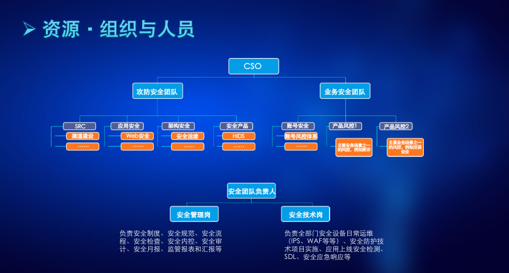

作者：聂军  
地址：金融企业安全运营建设之路.pdf

不同的信任假设决定了安全方案的复杂程度和实施成本，安全需要平衡

信息安全就是博弈和对抗，是一场人与人之间的战争。交战双方所争夺的都是信息资产的控制权，也就是在博弈和对抗中，牢牢的把握各类信息资产的控制权。

安全防护框架-纵深防御  
1：安全总控层安全：日志统一管理、SOC安全总控中心（SOC为安全运营）  
2：用户层安全管控：安全客户端、双重身份认证、堡垒机  
3：数据层安全管控：数据库防护、数据防泄漏、邮件DLP、文印系统  
4：应用层安全管控：开发安全规范、应用防护、网站防篡改、应用层漏洞扫描、安全控件  
5：系统层安全管控：安全基线、恶意软件检测、异常流量、系统漏洞扫描、蜜罐、终端安全管理  
6：虚拟层安全管控：虚拟层安全防护、虚拟主机安全加固  
7：网络层安全管控：安全域划分、防火墙、异常流量、入侵检测防御、信道加密、DNS防护

安全验证框架  
1：白盒检测（过程验证）  
验证安全Sensor安全监测功能有效（Sensor，探针）  
验证安全Sensor所产生监测信息到SIEM平台的信息采集有效  
验证SIEM平台的安全监测规则有效（SIEM，security information and event management，安全信息和事件的管理系统）  
验证告警方式（邮件、短信和可视化 展示平台）有效  
2：黑盒检测（结果验证）  
安全众测  
红蓝对抗演习  

安全为业务服务  
1：减少资损（创收）  
2：降低系统性能压力（降本）  
3：智能预警威胁感知（提效）  
4：同人模型降低安全交付认证复杂度（提升用户体验）  
5：安全应急和危机公关（保持和提升品牌公信力）  
6：积累风险库和模型反驱动业务规则优化（反欺诈、降低坏账等）

企业安全建设三个阶段  
1：基础安全建设  
2：系统建设阶段  
3：安全高阶建设  
